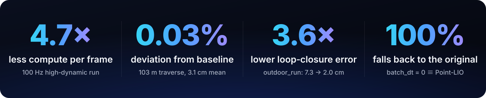
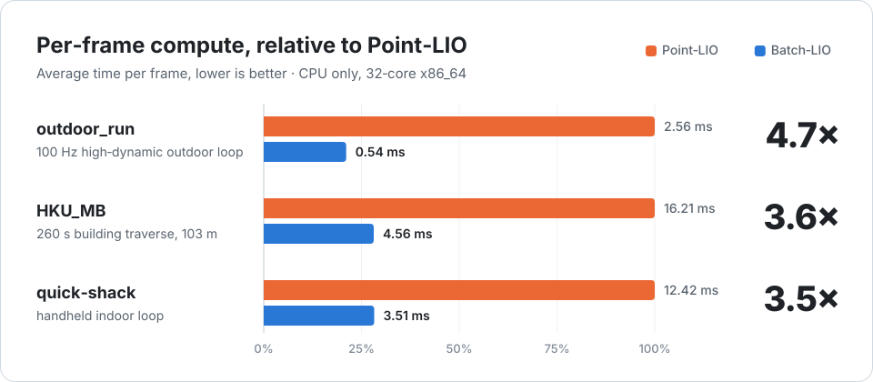
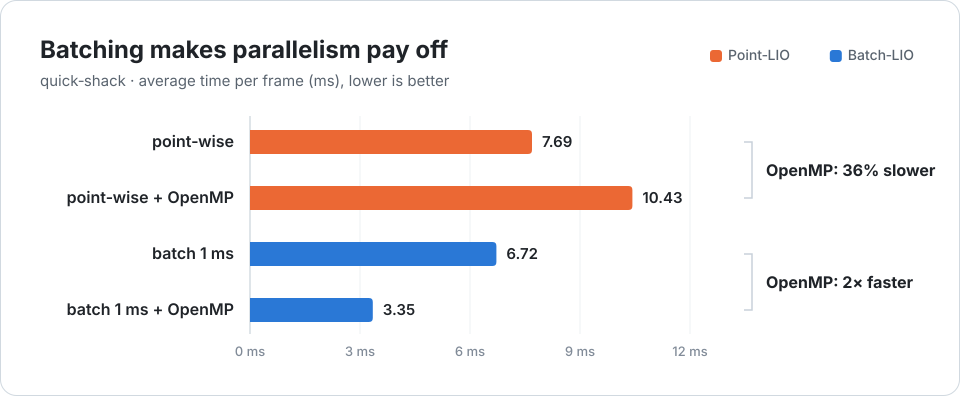
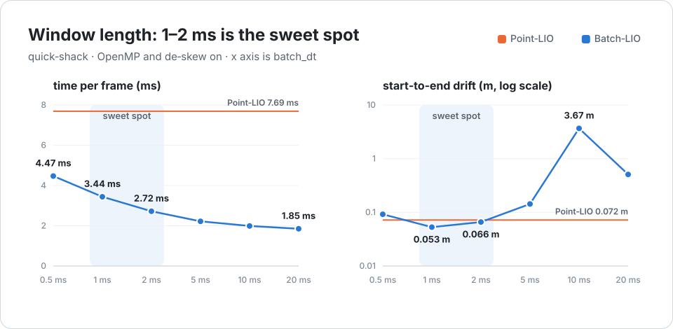
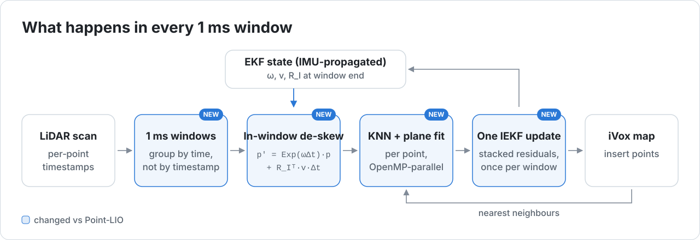

<div align="center">



<br>
<br>

<h1>Same accuracy. A quarter of the compute.</h1>

<p>
<b>Batch‑LIO</b> changes how often Point‑LIO updates the filter:<br>
instead of point by point, it updates once per <b>millisecond</b> batch.
</p>

<p>
<a href="#get-started"></a>
<a href="#engineered-to-be-trusted"></a>
<a href="LICENSE"></a>
</p>

<a href="#performance"><b>Performance</b></a>&nbsp;&nbsp;·&nbsp;&nbsp;<a href="#how-it-works"><b>How it works</b></a>&nbsp;&nbsp;·&nbsp;&nbsp;<a href="#get-started"><b>Get started</b></a>&nbsp;&nbsp;·&nbsp;&nbsp;<a href="#whats-next"><b>What's next</b></a>&nbsp;&nbsp;·&nbsp;&nbsp;<a href="README.md">中文</a>

<br>
<br>



</div>

<br>

## How far can a robot move in a millisecond?

Point‑LIO showed that updating **point by point** lets LiDAR‑inertial odometry keep up with the
most aggressive motion. The price is thousands of tiny filter updates in every frame.

Batch‑LIO's answer: a millisecond is short enough to **compensate the motion first** and update
**once**. Fewer updates, larger batches, and multi‑core parallelism finally pays off.

<br>

## Performance

<picture>
  <source media="(prefers-color-scheme: dark)" srcset="docs/assets/speedup-en-dark.svg">
  
</picture>

<br>
<br>

<picture>
  <source media="(prefers-color-scheme: dark)" srcset="docs/assets/omp-en-dark.svg">
  
</picture>

<br>
<br>

<picture>
  <source media="(prefers-color-scheme: dark)" srcset="docs/assets/sweep-en-dark.svg">
  
</picture>

<details>
<summary><b>Data tables</b></summary>

<br>

| Sequence | Scene | Point‑LIO | Batch‑LIO | Gain |
|---|---|---:|---:|:---:|
| outdoor_run | 100 Hz high‑dynamic outdoor loop | 2.56 ms | **0.54 ms** | **4.7×** |
| HKU_MB | 260 s building traverse, 103 m | 16.21 ms | **4.56 ms** | **3.6×** |
| quick‑shack | handheld indoor loop | 12.42 ms | **3.51 ms** | **3.5×** |

| Sequence | Metric | Point‑LIO | Batch‑LIO |
|---|---|---:|---:|
| HKU_MB (103 m) | mean deviation from baseline | — | 0.031 m |
| outdoor_run (loop) | start‑to‑end closure | 0.073 m | **0.020 m** |
| quick‑shack (loop) | start‑to‑end closure | 0.072 m | **0.053 m** |

De‑skew amplification: with a 20 ms window, drift is 7.59 m with de‑skew off and 0.51 m with it on.<br>
Full data: [ROS 1](docs/RESULTS.md) · [ROS 2](docs/RESULTS_ROS2.md).

</details>

<br>

## How it works

<picture>
  <source media="(prefers-color-scheme: dark)" srcset="docs/assets/pipeline-en-dark.svg">
  
</picture>

<table>
<tr>
<td width="33%" valign="top">
<b>Millisecond windows</b><br>
<sub>Points are grouped by time, not by identical timestamp. The window is tunable; 1–2 ms works best.</sub>
</td>
<td width="33%" valign="top">
<b>In‑window de‑skew</b><br>
<sub>Each point is compensated to the window end with the filter's own angular and linear velocity, verified by unit tests and an amplification experiment.</sub>
</td>
<td width="33%" valign="top">
<b>Batching enables parallelism</b><br>
<sub>Multithreading slows point‑wise mode down; after batching it doubles the speed. The gain comes from the architecture, not from tuning.</sub>
</td>
</tr>
</table>

<br>

## Get started

```bash
# Build: livox_ros_driver2 and Batch-LIO as sibling packages in one workspace
mkdir -p ~/batch_lio_ws/src && cd ~/batch_lio_ws/src
ln -sfn /path/to/livox_ros_driver2 livox_ros_driver2
ln -sfn /path/to/Batch-LIO         batch_lio
source /opt/ros/humble/setup.bash && cd .. && colcon build --symlink-install

# Run with multithreading on: the configuration used in the performance charts
source install/setup.bash
ros2 run batch_lio batchlio_mapping --ros-args \
  --params-file $(ros2 pkg prefix batch_lio)/share/batch_lio/config/avia.yaml \
  -p batch_omp:=true
ros2 bag play <your_avia_bag>          # in a second terminal
```

Odometry is published on `/aft_mapped_to_init`. Supports Livox Avia / Horizon, Ouster‑64 and Velodyne‑16;
ROS 1 bags convert with [`scripts/convert_bag.py`](scripts/convert_bag.py); for Jazzy see [`docker/`](docker/README.md).

| Parameter | Default | |
|---|---|---|
| `batch_dt` | `0.001` | window length in seconds; `0` gives the original Point‑LIO |
| `batch_omp` | `false` | multithreaded point matching |
| `batch_deskew` | `true` | in‑window motion de‑skew |

<br>

## Engineered to be trusted

- **Switch back to the original at any time**: at `batch_dt = 0` the trajectory is bit‑exact with Point‑LIO, so every speedup can be checked against the original.
- **Multithreading doesn't change results**: OpenMP on or off gives bit‑identical trajectories.
- **Tests**: 5 gtests on the de‑skew transform, plus an end‑to‑end test that plays a real bag and checks the odometry output.
- **Across ROS versions**: native ROS 2 Humble, a Docker image for Jazzy, and the ROS 1 version archived at the `ros1-noetic` tag.
- **Reproducible**: the A/B, sweep and ablation scripts are all in [`scripts/`](scripts/).

<br>

## What's next

**Edge deployment**: bring‑up on NVIDIA Jetson hardware, with full latency, power and thermal reports.<br>
**Ground‑truth evaluation**: ATE / RPE on public datasets with ground truth.<br>
**More speed**: adopt Small Point‑LIO ideas on the CPU and explore a GPU‑resident map.

<br>

<details>
<summary><b>About the numbers</b></summary>

<br>

- The baseline is Point‑LIO on the same bags with the same parameters; on ROS 2 it is `batch_dt = 0` in the same binary.
- These sequences have no ground truth: "deviation" means agreement with the Point‑LIO trajectory, and "closure" means the start‑to‑end distance on loop sequences.
- The test machine is a 32‑core x86_64; other platforms need to be measured again.
- The gain is compute efficiency, not odometry bandwidth: batching reduces the number of updates.
- This project reproduces innovation #1 of Point‑LIWO and does not include wheel odometry.

</details>

## Acknowledgements

Batch‑LIO is built on [Point‑LIO](https://github.com/hku-mars/Point-LIO) from HKU MARS Lab. The
batch‑update idea comes from the USTC undergraduate thesis *《高带宽轮式激光惯性里程计》* (Point‑LIWO)
by 张昊鹏; de‑skew follows the FAST‑LIO / sr_lio convention. If you use this project, please cite
Point‑LIO and FAST‑LIO. Licensed under [MIT](LICENSE); parts derived from Point‑LIO, LOAM and Livox
keep their BSD‑3 notices.

<div align="center">
<br>
<sub>If Batch‑LIO helps you, a ⭐ is always appreciated.</sub>
</div>
