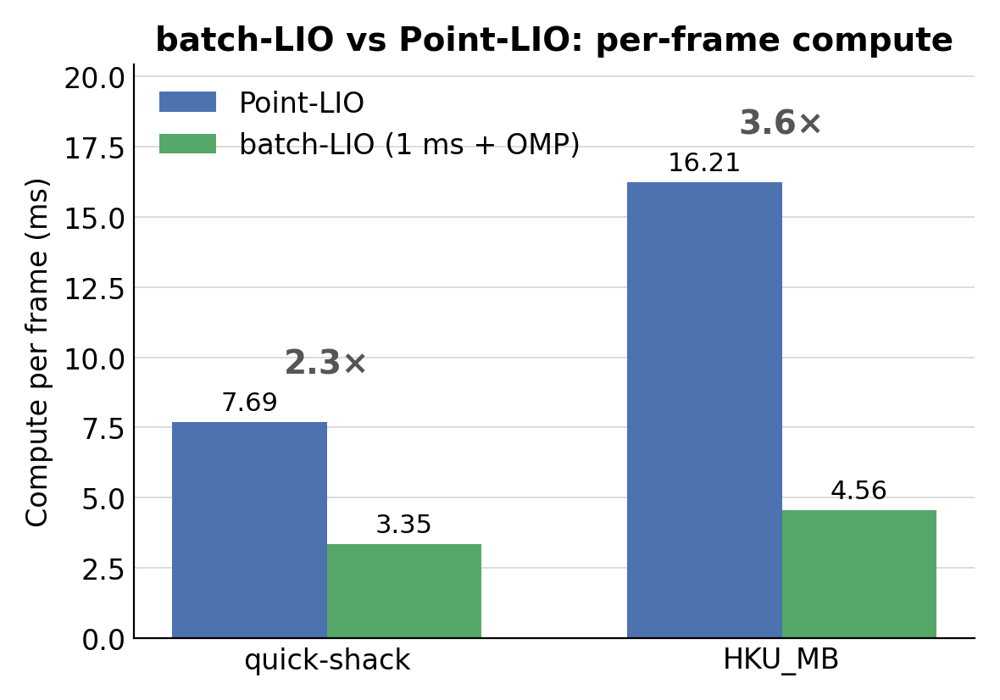
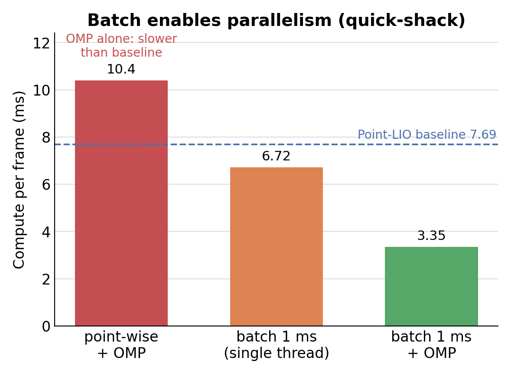
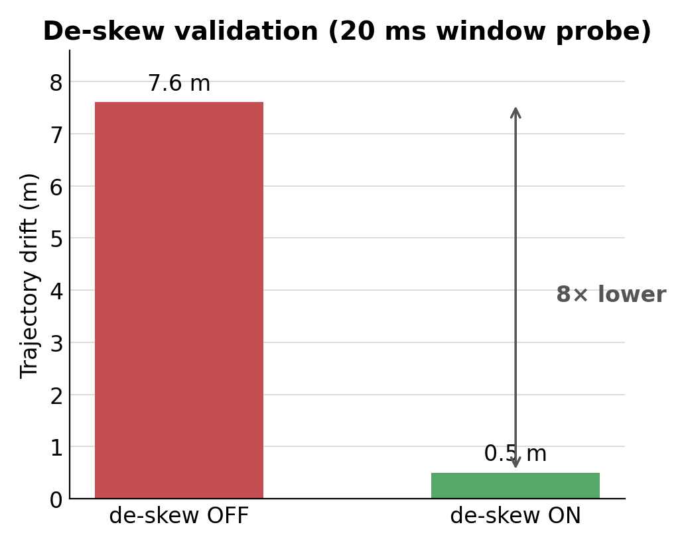
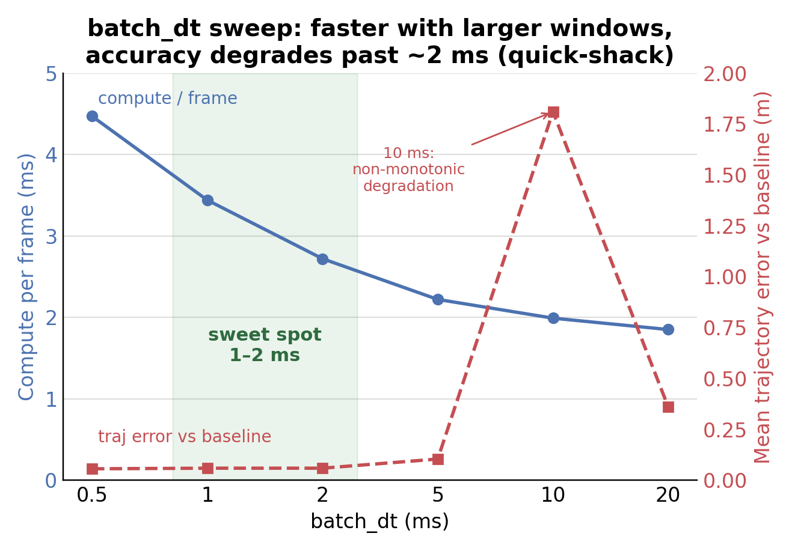

# batch-LIO

**A batch-wise extension of [Point-LIO](https://github.com/hku-mars/Point-LIO): per-~1 ms batch EKF update with in-batch motion de-skew, for high-bandwidth, lower-compute LiDAR-inertial odometry.**

This repo reproduces **innovation #1** of the undergraduate thesis *《高带宽轮式激光惯性里程计》(Point-LIWO — Batch-based Direct Point LiDAR-IMU-Wheeled-speed Odometry)*, USTC, by 张昊鹏. It is built directly on HKU-MARS **Point-LIO** and kept A/B-comparable with it (CPU-only; wheel-speed / innovation #2 is out of scope).

> Status: reproduction + evaluation complete and validated. Tested with `osrf/ros:noetic-desktop-full` on x86_64 (ROS1) and **natively on ROS2 Humble** (`ros2-humble` branch).

---

## What it changes vs Point-LIO

Point-LIO updates the EKF **point-wise** (one update per distinct point timestamp) and already row-stacks the measurement Jacobian over a group of same-timestamp points. batch-LIO changes two things and adds OpenMP:

1. **1 ms time-window grouping** — points are grouped into fixed ~1 ms windows instead of by identical timestamp (`time_compressing_batch`, `include/common_lib.h`).
2. **In-batch de-skew** — because a window now spans many timestamps, each point is motion-compensated to the window's reference (last-point) time using the EKF state's angular/linear velocity, then all valid residuals are row-stacked into a **single EKF update per window** (`src/deskew.h`, applied in `src/laserMapping.cpp`). This implements thesis eq. 3.44–3.47:

   ```
   Δtⱼ = tⱼ − t_last                 (≤ 0 within a window)
   Rⱼ  = Exp(ω · Δtⱼ)                (ω = state body angular velocity)
   Tⱼ  = R_Iᵀ · v · Δtⱼ              (v = state world linear velocity; R_I = state rotation)
   p'ⱼ = Rⱼ · pⱼ + Tⱼ
   ```

3. **OpenMP** on the per-point KNN + plane-fit loop (`src/Estimator.cpp`). Crucially, OpenMP only pays off **after** batching enlarges the groups — on Point-LIO's tiny per-timestamp groups it is *slower* (fork/join overhead).

All changes are gated by ROS params (defaults make it equivalent to Point-LIO when `batch_dt ≤ 0`):

| param | default | meaning |
|-------|---------|---------|
| `batch_dt` | `0.001` | batch window length in **seconds** (`≤ 0` ⇒ point-wise, i.e. Point-LIO) |
| `batch_omp` | `false` | OpenMP on the KNN+plane-fit loop |
| `batch_deskew` | `true` | in-window de-skew on/off (ablation toggle) |

---

## Results

A/B vs pristine Point-LIO, same bag and parameters, CPU-only on a 32-core x86_64 machine. Full numbers and method in [`docs/RESULTS.md`](docs/RESULTS.md).

### Per-frame compute: 2.3–3.6× faster, equal-or-better accuracy


batch-LIO matches the baseline trajectory to ~3 cm mean over a 103 m path (HKU_MB), and closes the `outdoor_run` loop *better* than baseline (0.020 m vs 0.073 m).

### OpenMP only helps after batching ("batch enables parallelism")


### De-skew correctness (20 ms window probe): 8× lower drift


This probe also resolved an ambiguity in the thesis: the correct same-frame transform is `Tⱼ = R_Iᵀ·v·Δtⱼ` (not a literal world-frame `v·Δtⱼ`).

### batch_dt sweep: 1–2 ms is the sweet spot


### High output bandwidth (publish per window)
| mode | stable odom rate |
|------|------------------|
| Point-LIO frame-rate odom | ~10 Hz |
| **batch-LIO 1 ms (publish per window)** | **~913 Hz** |
| Point-LIO point-wise (publish per point) | ~6.7 kHz (per-point, noisy) |

---

## Build & Run (ROS2 Humble, native)

A ROS2 Humble port lives on the **`ros2-humble`** branch (`main` stays the pristine ROS1
Noetic A/B baseline). It is a thin faithful port — same algorithm, same params — verified
end-to-end on converted Livox Avia bags (`colcon test` green: deskew gtest + smoke launch_test).

### 1. Workspace + build

```bash
# livox_ros_driver2 (vendored SDK2) as a sibling package; batch_lio symlinked from this repo
mkdir -p ~/batch_lio_ws/src
ln -sfn /path/to/livox_ros_driver2  ~/batch_lio_ws/src/livox_ros_driver2
ln -sfn /home/as/vllm/Batch-LIO     ~/batch_lio_ws/src/batch_lio
source /opt/ros/humble/setup.bash
cd ~/batch_lio_ws && colcon build --symlink-install
```

### 2. Convert a ROS1 Avia bag to ROS2 (mcap)

```bash
python3 -m pip install --user rosbags pyyaml
python3 scripts/convert_bag.py  your_avia.bag  ~/batch_lio_ws/bags/your_avia
# renames livox_ros_driver/CustomMsg -> livox_ros_driver2/msg/CustomMsg (byte-identical wire format)
```

### 3. Run

```bash
source ~/batch_lio_ws/install/setup.bash
ros2 launch batch_lio mapping_avia.launch.py            # rviz2 on; or rviz:=false for headless
ros2 bag play ~/batch_lio_ws/bags/your_avia             # in another shell
ros2 topic echo /aft_mapped_to_init                     # odometry
```

### 4. Test + A/B

```bash
colcon test --packages-select batch_lio                 # deskew gtest + smoke launch_test
bash scripts/ablations.sh                               # speedup + deskew (point-wise vs 1ms batch)
python3 scripts/compare_traj.py LABEL run/out/<run>/pos_log.txt run/out/<run>/node.log [baseline_pos_log]
```

Differences from the ROS1 build: ament_cmake (`colcon build`) instead of catkin, Python launch
files, ROS2 params (config YAMLs wrapped in `/**: {ros__parameters:}`), `tf2_ros`, and the
type-tolerant param loader (YAML int→double coercion). See
[`docs/superpowers/specs/2026-07-22-ros2-humble-port-design.md`](docs/superpowers/specs/2026-07-22-ros2-humble-port-design.md).

---

## Build (Docker, ROS Noetic)

```bash
# 1) container (CPU-only, host network so a bag can be played from the host)
docker run -d --name batch-lio --network host \
  -v <host_workspace>:/root/ws -w /root/ws \
  osrf/ros:noetic-desktop-full tail -f /dev/null

# 2) dependencies (inside the container)
docker exec batch-lio bash -lc 'apt-get update && apt-get install -y libgoogle-glog-dev'
# Livox-SDK (provides the SDK that livox_ros_driver links against):
#   git clone https://github.com/Livox-SDK/Livox-SDK && cd Livox-SDK/build && cmake .. && make -j && make install
# livox_ros_driver (provides the CustomMsg message used by Avia bags):
#   clone https://github.com/Livox-SDK/livox_ros_driver into your catkin_ws/src

# 3) build (catkin workspace with src/{livox_ros_driver, batch_lio})
docker exec batch-lio bash -lc 'source /opt/ros/noetic/setup.bash && cd /root/ws/catkin_ws && catkin_make -j8'
```

Dependencies beyond `noetic-desktop-full`: **`libgoogle-glog-dev`** (Point-LIO's `ivox3d.h` needs glog) and **Livox-SDK** + **`livox_ros_driver`** (for the `livox_ros_driver/CustomMsg` LiDAR topic).

### Unit test (de-skew transform)
```bash
catkin_make && ./devel/lib/batch_lio/test_deskew   # -> ALL DESKEW TESTS PASSED
```

---

## Run

Works on standard Livox Avia bags (`/livox/lidar` = `livox_ros_driver/CustomMsg`, `/livox/imu` = `sensor_msgs/Imu`), e.g. the HKU-MARS / FAST-LIO Avia sequences.

```bash
roscore &
roslaunch batch_lio mapping_avia.launch &        # or the headless scripts/avia_batch.launch
rosbag play your_avia.bag
```

A self-contained headless harness used for the A/B study lives in [`scripts/`](scripts):
- `scripts/avia_batch.launch` — args `batch_dt`, `batch_omp`, `batch_deskew`, `pub_hifreq`
- `scripts/run_lio.sh <launch> <bag> <outdir> [rate] [logsrc] ["launch:=args"]` — roscore → node → record `/aft_mapped_to_init` → play → harvest `Log/pos_log.txt`
- `scripts/compare_traj.py <label> <pos_log> <node_log> [baseline_pos_log]` — timing + trajectory metrics
- `scripts/ablations.sh` — the bandwidth / sweep / aggressive-bag runs

Odometry is published on `/aft_mapped_to_init`; per-frame stage timings are printed as `[ mapping ]:` lines; the trajectory is logged to `Log/pos_log.txt` when `runtime_pos_log_enable` is set.

---

## Repository layout

```
src/            modified Point-LIO sources
  deskew.h          NEW: in-batch de-skew (eq 3.44-3.47), header-only + unit-tested
  laserMapping.cpp  batch grouping call + per-window de-skew before the EKF update + OMP thread control
  Estimator.cpp     OpenMP on the KNN + plane-fit loop
  parameters.*      batch_dt / batch_omp / batch_deskew params
include/common_lib.h  time_compressing_batch (1 ms windows)
test/test_deskew.cpp  standalone unit test for the de-skew transform
docs/            PLAN.md, RESULTS.md, figures/
scripts/         headless run + analysis harness
```

---

## Attribution & license

- Built on **[Point-LIO](https://github.com/hku-mars/Point-LIO)** (HKU-MARS); please cite Point-LIO and FAST-LIO. The batch-update idea reproduced here is from the USTC undergraduate thesis *《高带宽轮式激光惯性里程计》(Point-LIWO)* by 张昊鹏.
- De-skew follows the FAST-LIO / sr_lio motion-compensation convention; the map uses an iVox-style hashed-voxel structure.
- License follows the upstream Point-LIO / LOAM / Livox license — see [`LICENSE`](LICENSE). This is a research reproduction.
