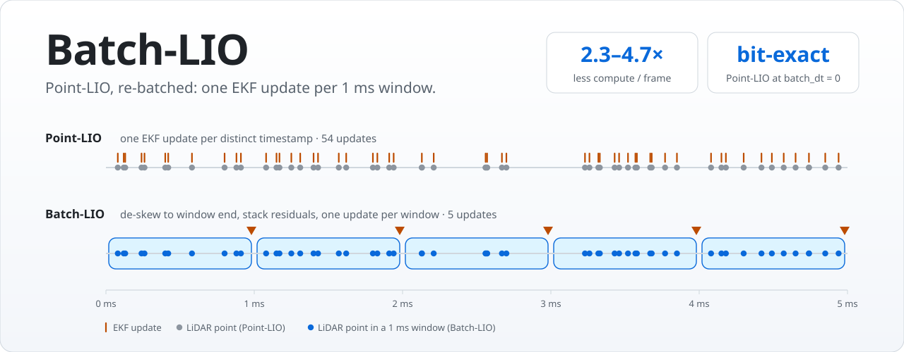
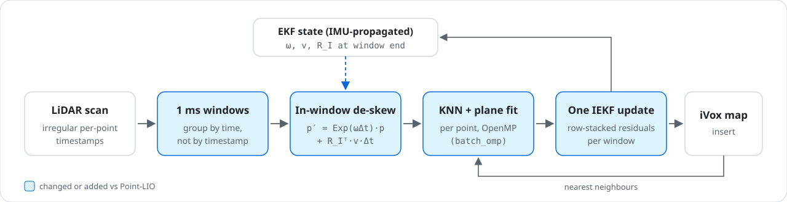
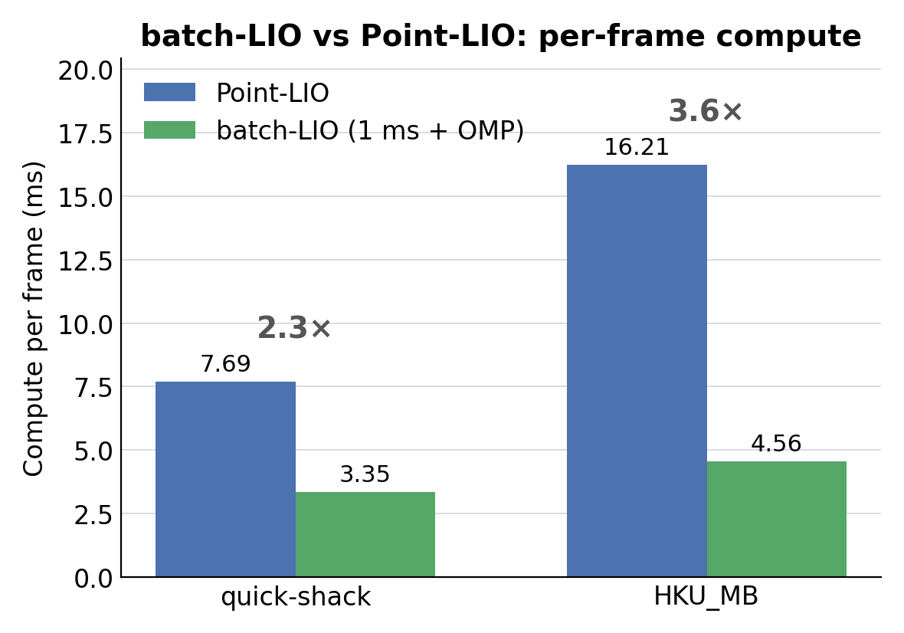
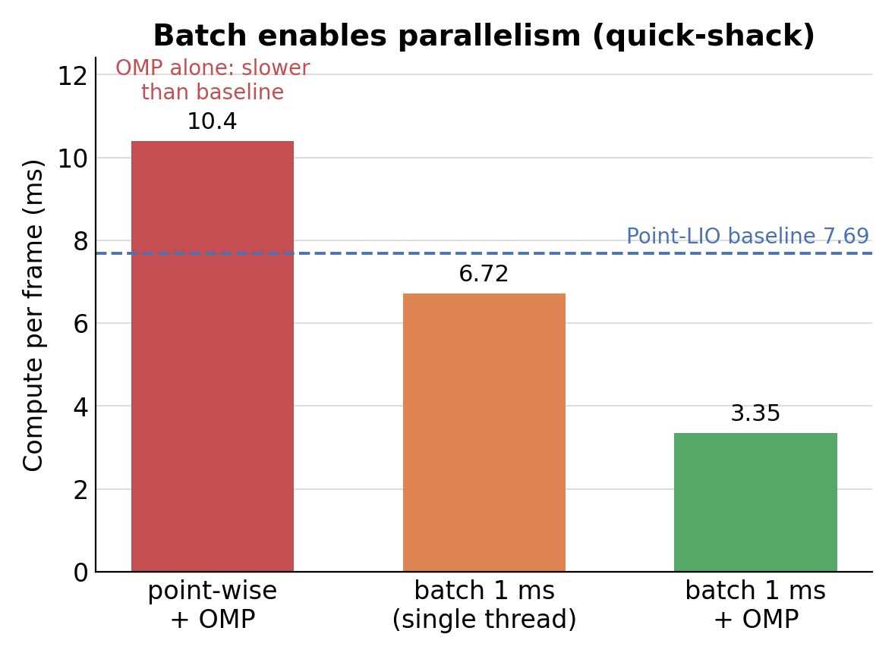
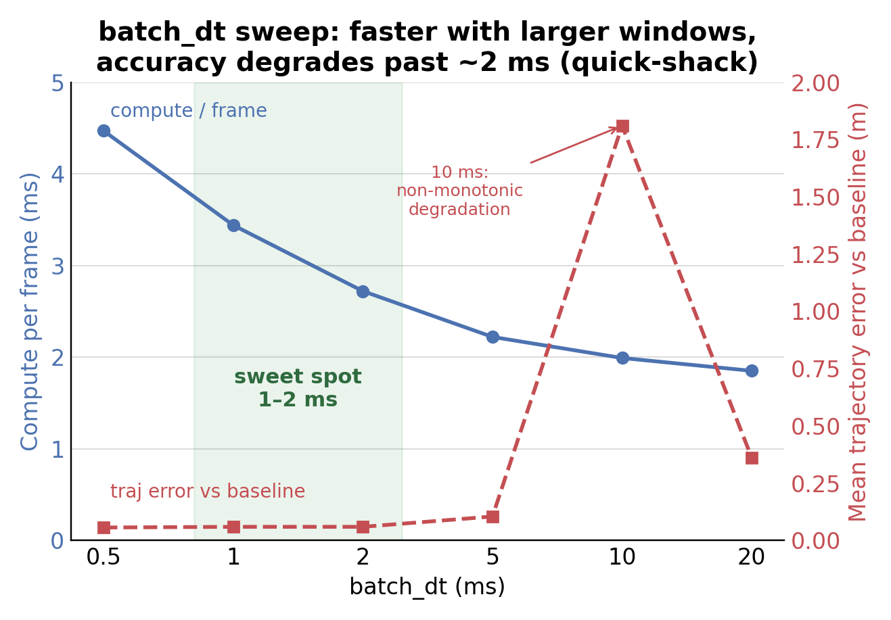

<div align="center">

<picture>
  <source media="(prefers-color-scheme: dark)" srcset="docs/assets/hero-dark.svg">
  <source media="(prefers-color-scheme: light)" srcset="docs/assets/hero-light.svg">
  
</picture>

<br>

# 算力最高直降 4.7 倍，轨迹几乎不变。

**Batch‑LIO** 重新设计了 Point‑LIO 的更新节奏：<br>
不再逐点更新，而是以 **1 毫秒**为单位整批更新。

<br>

[](#-三分钟上手)
[](docker/README.md)
[](#-工程品质)
[](LICENSE)

<b>中文</b> · <a href="README.en.md">English</a>

</div>

<br>

<table>
<tr>
<td align="center" width="33%">
<h1>4.7×</h1>
<b>每帧算力最高降低</b><br>
<sub>100 Hz 剧烈运动序列</sub>
</td>
<td align="center" width="33%">
<h1>0.03 %</h1>
<b>与基线的轨迹偏差</b><br>
<sub>103 m 楼宇穿行，平均 3.1 cm</sub>
</td>
<td align="center" width="33%">
<h1>100 %</h1>
<b>可回退到原版</b><br>
<sub><code>batch_dt = 0</code> 与 Point‑LIO 逐位一致</sub>
</td>
</tr>
</table>

---

## 一个想法，改变更新的粒度

Point‑LIO 证明了**逐点更新**能让激光‑惯性里程计跟上最剧烈的运动，
代价是每一帧都要执行成千上万次微小的滤波更新。

Batch‑LIO 提出了一个问题：**一毫秒之内，机器人又能移动多远？**

我们的答案是：可以短到先做**运动补偿**，再**一次性**完成更新。
每个点先被精确地补偿到窗口末时刻，然后所有残差合并成一次 EKF 更新。
更新次数减少了，每一批点也足够多，多核并行终于有了用武之地。

<picture>
  <source media="(prefers-color-scheme: dark)" srcset="docs/assets/pipeline-dark.svg">
  <source media="(prefers-color-scheme: light)" srcset="docs/assets/pipeline-light.svg">
  
</picture>

<table>
<tr>
<td width="33%" valign="top">

#### ⏱ 毫秒级时间窗
按时间分组，而不是按时间戳分组。
窗口长度可调，扫描实验表明 1–2 ms 效果最好。

</td>
<td width="33%" valign="top">

#### 🌀 窗内运动去畸变
每个点都按滤波器估计的角速度和线速度补偿到窗口末时刻。
补偿公式有单元测试和放大实验两重验证。

</td>
<td width="33%" valign="top">

#### ⚡ 分批带来并行
逐点模式下开多线程**反而更慢**，分批之后多线程能再**快一倍**。
加速来自架构本身，而不是调参。

</td>
</tr>
</table>

---

## 📈 性能

<p align="center">
  
  &nbsp;
  
</p>

| 序列 | 场景 | Point‑LIO | **Batch‑LIO** | 提升 |
|---|---|---:|---:|:---:|
| **outdoor_run** | 100 Hz 高动态户外回环 | 2.56 ms | **0.54 ms** | **4.7×** |
| **HKU_MB** | 260 s 楼宇穿行，103 m | 16.21 ms | **4.56 ms** | **3.6×** |
| **quick‑shack** | 手持室内回环 | 12.42 ms | **3.51 ms** | **3.5×** |

<sub>每帧平均耗时，数值越低越好。纯 CPU，32 核 x86_64。完整数据：[ROS 1](docs/RESULTS.md) · [ROS 2](docs/RESULTS_ROS2.md)。</sub>

<details>
<summary><b>轨迹一致性、窗口长度扫描与消融实验</b></summary>

<br>

**轨迹一致性**

| 序列 | 指标 | Point‑LIO | Batch‑LIO |
|---|---|---:|---:|
| HKU_MB（103 m） | 相对基线平均偏差 | — | 0.031 m |
| outdoor_run（回环） | 首尾闭合误差 | 0.073 m | **0.020 m**¹ |
| quick‑shack（回环） | 首尾闭合误差 | 0.072 m | **0.053 m** |

<sub>¹ ROS 1 结果。ROS 2 复测时同一序列为 0.085 m（去畸变关闭时为 0.079 m），闭合误差的优势没有稳定复现，详见 [`RESULTS_ROS2.md`](docs/RESULTS_ROS2.md)。</sub>

**窗口长度**：0.5–2 ms 时轨迹与基线吻合，同时快 1.7–2.8 倍；≥ 5 ms 时匀速假设不再成立，漂移明显增大。



**去畸变放大实验**：把窗口放大到 20 ms，关闭去畸变时漂移为 7.59 m，打开后降到 0.51 m。

**里程计频率**：按窗口发布约 913 Hz。Point‑LIO 按帧发布约 10 Hz，按点发布约 6.7 kHz。

</details>

---

## 🚀 三分钟上手

```bash
# 构建：livox_ros_driver2 与 Batch‑LIO 作为同级包放进工作区
mkdir -p ~/batch_lio_ws/src && cd ~/batch_lio_ws/src
ln -sfn /path/to/livox_ros_driver2 livox_ros_driver2
ln -sfn /path/to/Batch-LIO         batch_lio
source /opt/ros/humble/setup.bash && cd .. && colcon build --symlink-install

# 运行：开启多线程，即为性能表中的配置
source install/setup.bash
ros2 run batch_lio batchlio_mapping --ros-args \
  --params-file $(ros2 pkg prefix batch_lio)/share/batch_lio/config/avia.yaml \
  -p batch_omp:=true
ros2 bag play <your_avia_bag>          # 另开一个终端
```

里程计发布在 `/aft_mapped_to_init`。支持 Livox Avia / Horizon、Ouster‑64、Velodyne‑16。
ROS 1 bag 可用 [`scripts/convert_bag.py`](scripts/convert_bag.py) 一键转换；带 RViz 的启动方式：`ros2 launch batch_lio mapping_avia.launch.py`。

**三个参数，全部掌控：**

| 参数 | 默认 | |
|---|---|---|
| `batch_dt` | `0.001` | 时间窗长度（秒），设为 `0` 即原版 Point‑LIO |
| `batch_omp` | `false` | 多线程点匹配 |
| `batch_deskew` | `true` | 窗内运动去畸变 |

---

## 🛡 工程品质

- **随时可以切回原版**：`batch_dt = 0` 时与 Point‑LIO 的轨迹**逐位相同**，每个加速比都能回到原版复核；
- **多线程不影响结果**：OpenMP 开或关，轨迹逐位相同；
- **测试覆盖**：去畸变公式有 5 项 gtest，另有一项端到端测试，真实 bag 进、里程计出；
- **跨版本**：原生支持 ROS 2 Humble，Jazzy 提供 [Docker 镜像](docker/README.md)，ROS 1 版本在 `ros1-noetic` tag 归档；
- **可复现**：A/B 对比、参数扫描与消融脚本全部在 [`scripts/`](scripts/) 中。

---

## 🗺 下一站

| | |
|:-:|---|
| 🤖 | **边缘部署**：NVIDIA Jetson 实机适配，提供延迟、功耗与温度的完整报告 |
| 🎯 | **真值评测**：在带真值的公开数据集上报告 ATE / RPE |
| ⚙️ | **进一步提速**：CPU 端吸收 Small Point‑LIO 的思路，并探索 GPU 常驻地图 |

---

<details>
<summary><b>关于数字</b></summary>

<br>

- 对照对象是 Point‑LIO，同一 bag、同一参数；ROS 2 数据的对照为同一二进制下的 `batch_dt = 0`。
- 这些序列没有真值：「偏差」指与 Point‑LIO 轨迹的吻合度，「闭环误差」指回环序列的首尾距离。
- 测试平台为 32 核 x86_64，其他平台需要重新测量。
- 提升的是算力效率，而不是里程计带宽：分批会减少更新次数。
- 本项目复现 Point‑LIWO 的创新点一，不包含轮速计。

</details>

## 致谢

Batch‑LIO 基于港大 MARS 实验室的 **[Point‑LIO](https://github.com/hku-mars/Point-LIO)**，
分批更新的思路来自中国科学技术大学张昊鹏的本科毕业设计《高带宽轮式激光惯性里程计》（Point‑LIWO）。
去畸变沿用 FAST‑LIO 和 sr_lio 的运动补偿写法。使用本项目时请引用 Point‑LIO 与 FAST‑LIO。

本项目采用 [MIT](LICENSE) 许可，源自 Point‑LIO、LOAM、Livox 的部分保留其 BSD‑3 声明。

<div align="center">
<br>
<sub>如果 Batch‑LIO 对你有帮助，欢迎点一个 ⭐</sub>
</div>
