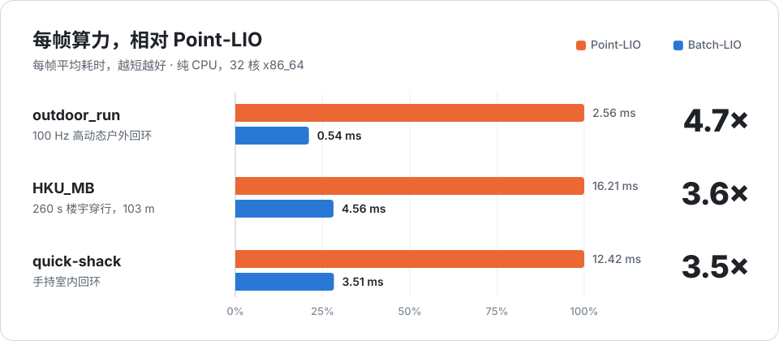
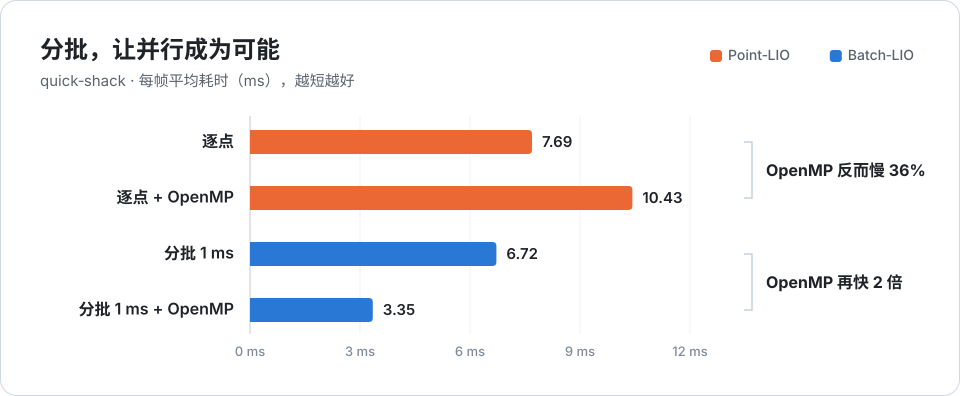
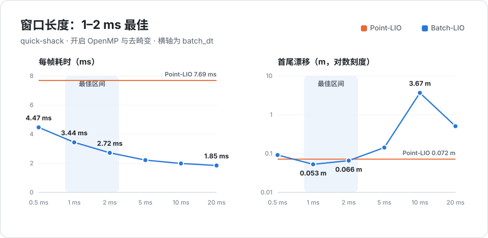
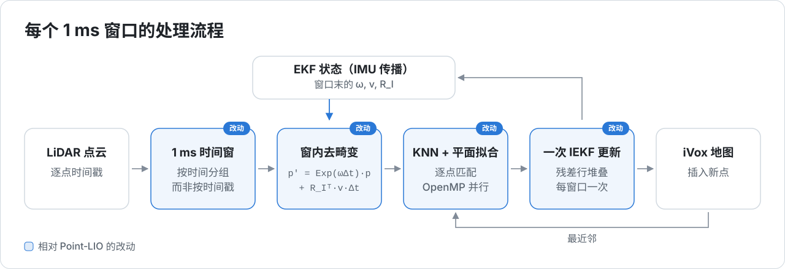

<div align="center">


<br>
<br>

<h1>同样的精度，四分之一的算力。</h1>

<p>
<b>Batch‑LIO</b> 重新设计了 Point‑LIO 的更新节奏：<br>
不再逐点更新，而是以 <b>1 毫秒</b>为单位整批更新。
</p>

<p>
<a href="#快速上手"></a>
<a href="#工程品质"></a>
<a href="LICENSE"></a>
</p>

<a href="#性能"><b>性能</b></a>&nbsp;&nbsp;·&nbsp;&nbsp;<a href="#原理"><b>原理</b></a>&nbsp;&nbsp;·&nbsp;&nbsp;<a href="#快速上手"><b>快速上手</b></a>&nbsp;&nbsp;·&nbsp;&nbsp;<a href="#下一站"><b>下一站</b></a>&nbsp;&nbsp;·&nbsp;&nbsp;<a href="README.en.md">English</a>

<br>
<br>


</div>

<br>

## 一毫秒，能走多远？

Point‑LIO 证明了**逐点更新**能让激光‑惯性里程计跟上最剧烈的运动，
代价是每一帧都要执行成千上万次微小的滤波更新。

Batch‑LIO 的回答是：一毫秒短到足以**先把运动补偿掉**，再**一次性**完成更新。
更新次数少了，每一批点也足够多，多核并行终于派上了用场。

<br>

## 性能

<picture>
  <source media="(prefers-color-scheme: dark)" srcset="docs/assets/speedup-zh-dark.svg">
  
</picture>

<br>
<br>

<picture>
  <source media="(prefers-color-scheme: dark)" srcset="docs/assets/omp-zh-dark.svg">
  
</picture>

<br>
<br>

<picture>
  <source media="(prefers-color-scheme: dark)" srcset="docs/assets/sweep-zh-dark.svg">
  
</picture>

<details>
<summary><b>数据表</b></summary>

<br>

| 序列 | 场景 | Point‑LIO | Batch‑LIO | 提升 |
|---|---|---:|---:|:---:|
| outdoor_run | 100 Hz 高动态户外回环 | 2.56 ms | **0.54 ms** | **4.7×** |
| HKU_MB | 260 s 楼宇穿行，103 m | 16.21 ms | **4.56 ms** | **3.6×** |
| quick‑shack | 手持室内回环 | 12.42 ms | **3.51 ms** | **3.5×** |

| 序列 | 指标 | Point‑LIO | Batch‑LIO |
|---|---|---:|---:|
| HKU_MB（103 m） | 相对基线平均偏差 | — | 0.031 m |
| outdoor_run（回环） | 首尾闭合误差 | 0.073 m | **0.020 m** |
| quick‑shack（回环） | 首尾闭合误差 | 0.072 m | **0.053 m** |

去畸变放大实验：窗口放大到 20 ms 时，关闭去畸变漂移 7.59 m，打开后 0.51 m。<br>
完整数据：[ROS 1](docs/RESULTS.md) · [ROS 2](docs/RESULTS_ROS2.md)。

</details>

<br>

## 原理

<picture>
  <source media="(prefers-color-scheme: dark)" srcset="docs/assets/pipeline-zh-dark.svg">
  
</picture>

<table>
<tr>
<td width="33%" valign="top">
<b>毫秒级时间窗</b><br>
<sub>按时间分组，而不是按时间戳分组。窗口长度可调，1–2 ms 效果最好。</sub>
</td>
<td width="33%" valign="top">
<b>窗内运动去畸变</b><br>
<sub>每个点按滤波器估计的角速度和线速度补偿到窗口末时刻，公式经单元测试与放大实验双重验证。</sub>
</td>
<td width="33%" valign="top">
<b>分批带来并行</b><br>
<sub>逐点模式下多线程反而更慢；分批之后，多线程再快一倍。加速来自架构，而不是调参。</sub>
</td>
</tr>
</table>

<br>

## 快速上手

```bash
# 构建：livox_ros_driver2 与 Batch‑LIO 作为同级包放进工作区
mkdir -p ~/batch_lio_ws/src && cd ~/batch_lio_ws/src
ln -sfn /path/to/livox_ros_driver2 livox_ros_driver2
ln -sfn /path/to/Batch-LIO         batch_lio
source /opt/ros/humble/setup.bash && cd .. && colcon build --symlink-install

# 运行：开启多线程，即为性能图中的配置
source install/setup.bash
ros2 run batch_lio batchlio_mapping --ros-args \
  --params-file $(ros2 pkg prefix batch_lio)/share/batch_lio/config/avia.yaml \
  -p batch_omp:=true
ros2 bag play <your_avia_bag>          # 另开一个终端
```

里程计发布在 `/aft_mapped_to_init`。支持 Livox Avia / Horizon、Ouster‑64、Velodyne‑16；
ROS 1 bag 可用 [`scripts/convert_bag.py`](scripts/convert_bag.py) 一键转换；Jazzy 见 [`docker/`](docker/README.md)。

| 参数 | 默认 | |
|---|---|---|
| `batch_dt` | `0.001` | 时间窗长度（秒），设为 `0` 即原版 Point‑LIO |
| `batch_omp` | `false` | 多线程点匹配 |
| `batch_deskew` | `true` | 窗内运动去畸变 |

<br>

## 工程品质

- **随时可以切回原版**：`batch_dt = 0` 时与 Point‑LIO 的轨迹逐位相同，每个加速比都能回到原版复核。
- **多线程不改变结果**：OpenMP 开或关，轨迹逐位相同。
- **测试**：去畸变公式 5 项 gtest，外加一项真实 bag 进、里程计出的端到端测试。
- **跨版本**：原生支持 ROS 2 Humble，Jazzy 提供 Docker 镜像，ROS 1 版本归档在 `ros1-noetic` tag。
- **可复现**：A/B 对比、参数扫描与消融脚本全部在 [`scripts/`](scripts/)。

<br>

## 下一站

**边缘部署**：NVIDIA Jetson 实机适配，完整报告延迟、功耗与温度。<br>
**真值评测**：在带真值的公开数据集上报告 ATE / RPE。<br>
**进一步提速**：CPU 端吸收 Small Point‑LIO 的思路，并探索 GPU 常驻地图。

<br>

<details>
<summary><b>关于数字</b></summary>

<br>

- 对照对象是 Point‑LIO，同一 bag、同一参数；ROS 2 数据的对照为同一二进制下的 `batch_dt = 0`。
- 这些序列没有真值：「偏差」指与 Point‑LIO 轨迹的吻合度，「闭环误差」指回环序列的首尾距离。
- 测试平台为 32 核 x86_64，其他平台需要重新测量。
- 提升的是算力效率，而不是里程计带宽：分批会减少更新次数。
- 本项目复现 Point‑LIWO 的创新点一，不包含轮速计。

</details>

## 致谢

Batch‑LIO 基于港大 MARS 实验室的 [Point‑LIO](https://github.com/hku-mars/Point-LIO)，
分批更新的思路来自中国科学技术大学张昊鹏的本科毕业设计《高带宽轮式激光惯性里程计》（Point‑LIWO），
去畸变沿用 FAST‑LIO 与 sr_lio 的运动补偿写法。使用本项目时请引用 Point‑LIO 与 FAST‑LIO。
本项目采用 [MIT](LICENSE) 许可，源自 Point‑LIO、LOAM、Livox 的部分保留其 BSD‑3 声明。

<div align="center">
<br>
<sub>如果 Batch‑LIO 对你有帮助，欢迎点一个 ⭐</sub>
</div>
